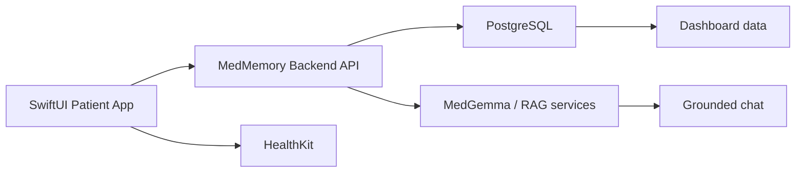
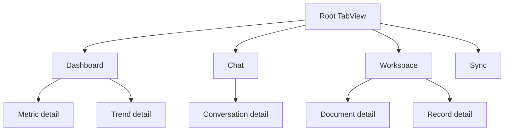

# SwiftUI Patient App Plan (March 2026)

## Decision

Replicating the **patient** experience in SwiftUI is a good idea.

Replicating the **entire app** in SwiftUI is not the right first move.

The patient side benefits from native iPhone capabilities:

- HealthKit
- camera / document upload
- push notifications
- smoother mobile navigation
- offline-friendly local state

The clinician side should stay web-first for now because it is denser, more operational, and better suited to larger screens.

## Recommended Scope

Build the iPhone app as a **native patient client** on top of the existing backend.

Keep these systems in the backend:

- auth
- patient records storage
- document processing
- RAG / MedGemma orchestration
- dashboard aggregation
- clinician workflows

Build these systems in SwiftUI:

- patient login shell
- patient dashboard
- patient chat
- records/documents browsing
- Apple Health sync
- notifications / sync status

## Why This Is The Right Move

It is a good idea if you keep the scope disciplined.

Good reasons:

- the patient experience is mobile-first
- Apple Health requires native iPhone code
- document capture is better with native camera/file flows
- your current visual language already fits an iPhone card-based experience

Bad reason:

- trying to rewrite backend logic, clinician workflows, and RAG orchestration into iOS

The correct split is:

- SwiftUI for patient-facing interaction
- FastAPI backend remains the source of truth
- clinician portal stays web-first

## Screen Mapping

Map the current patient web app into these SwiftUI surfaces.

### 1. Landing / auth

Current React references:

- [HeroSection.tsx](/Users/bryan.bosire/anaconda_projects/MedMemory/frontend/src/components/HeroSection.tsx)

SwiftUI equivalent:

- `WelcomeView`
- `SignInView`
- `CreateAccountView`

### 2. Patient dashboard

Current React references:

- [App.tsx](/Users/bryan.bosire/anaconda_projects/MedMemory/frontend/src/App.tsx)
- [ConnectionsPanel.tsx](/Users/bryan.bosire/anaconda_projects/MedMemory/frontend/src/components/dashboard/ConnectionsPanel.tsx)
- [HighlightsPanel.tsx](/Users/bryan.bosire/anaconda_projects/MedMemory/frontend/src/components/dashboard/HighlightsPanel.tsx)
- [TrendsPanel.tsx](/Users/bryan.bosire/anaconda_projects/MedMemory/frontend/src/components/dashboard/TrendsPanel.tsx)
- [FocusAreasPanel.tsx](/Users/bryan.bosire/anaconda_projects/MedMemory/frontend/src/components/dashboard/FocusAreasPanel.tsx)

SwiftUI equivalent:

- `PatientDashboardView`
- `HighlightsCard`
- `AppleHealthCard`
- `QuickActionsCard`
- `RecordsSnapshotCard`

### 3. Patient chat

Current React reference:

- [ChatInterface.tsx](/Users/bryan.bosire/anaconda_projects/MedMemory/frontend/src/components/ChatInterface.tsx)

SwiftUI equivalent:

- `PatientChatView`
- `ChatMessageBubble`
- `ChatComposer`
- `CitationBadgeRow`

### 4. Workspace

Current React references:

- [DocumentsPanel.tsx](/Users/bryan.bosire/anaconda_projects/MedMemory/frontend/src/components/DocumentsPanel.tsx)
- [RecordsPanel.tsx](/Users/bryan.bosire/anaconda_projects/MedMemory/frontend/src/components/RecordsPanel.tsx)

SwiftUI equivalent:

- `DocumentsView`
- `RecordsView`
- `UploadFlowView`
- `PatientWorkspaceView`

### 5. Apple Health

Current iPhone-side scaffold:

- [MedMemoryHealthSyncMVP](/Users/bryan.bosire/anaconda_projects/MedMemory/ios/MedMemoryHealthSyncMVP)

SwiftUI equivalent:

- `HealthSyncSettingsView`
- `StepTrendCard`
- `HealthSyncStatusBanner`

## Architecture

## Migration Principles

1. Keep backend contracts stable.
2. Reuse the same mental model as the web patient app.
3. Do not clone the web UI literally. Preserve flow and hierarchy, not exact HTML structure.
4. Use native iPhone patterns where they are clearly better.
5. Reuse one design token system across web and SwiftUI.

## Design Replication Rules

These are the concrete rules to keep the SwiftUI patient app recognizably MedMemory.

### Color and tone

- keep the warm neutral canvas
- keep orange as the primary action color
- use soft bordered cards, not heavy shadows
- keep success/refusal states explicit and calm

### Typography

- use a serif headline treatment for hero moments
- use compact sans-serif body text for operational content
- keep section labels uppercase and small, matching the web hierarchy

### Layout

- keep one hero summary at the top of the dashboard
- use horizontal summary cards for high-signal metrics
- stack major patient tasks vertically: understand, monitor, act
- move dense workspace actions into their own tab, not inside the dashboard feed

### Behavior

- preserve grounded-answer language from the web chat
- keep citations and refusal states visible
- keep Apple Health as a native sync/settings surface, then surface the result back in dashboard trends

## Parity Checklist

Use this checklist to judge whether the SwiftUI patient app is truly replicating the patient web product.

- landing/auth flow exists
- dashboard overview exists
- monitoring/trends exists
- workspace for documents/records exists
- grounded chat exists
- Apple Health sync exists
- upload flow exists
- retry/offline states exist
- patient can move between these flows in 1-2 taps

## UI Translation Rules

The goal is **product parity**, not pixel parity.

Translate the web app like this:

- Top nav tabs -> bottom `TabView`
- dashboard sections -> stacked cards and drill-in navigation
- dense tables -> grouped lists
- inline modals -> `sheet`
- panel sidebars -> separate detail screens or expandable cards

## Proposed SwiftUI Navigation

## Implementation Phases

### Phase 1. Native shell

- SwiftUI design system
- root `TabView`
- dashboard overview with placeholder cards
- chat prototype
- workspace prototype for records/documents
- Apple Health sync settings

### Phase 2. Real backend data

- fetch patient summary
- fetch dashboard highlights
- fetch Apple Health status/trend
- fetch records/documents
- fetch recent chat history / citations

### Phase 3. Native workflows

- camera scan / file picker upload
- notifications
- local caching
- retry and offline states
- auth persistence in Keychain

### Phase 4. Production hardening

- Keychain auth storage
- scoped mobile sync tokens
- background HealthKit sync
- analytics / crash reporting

## Recommended Build Order

1. Lock the design system and tab structure.
2. Wire dashboard highlights, trends, and Apple Health status to real APIs.
3. Wire workspace documents and records to real APIs.
4. Replace the chat prototype with the real grounded chat flow.
5. Add upload flows and offline/retry handling.
6. Add production auth and background sync.

## What Should Not Be Copied 1:1

- clinician portal layouts
- large desktop grids
- web-specific split panes
- dense button rows

## Good Idea or Not

Yes, for the patient experience.

No, for a full backend rewrite.

The correct strategy is:

- native SwiftUI patient app
- existing backend remains source of truth
- clinician workflows remain web-first

## Current Scaffold Status

Implemented in the repo:

- HealthKit sync MVP
- Apple Health backend endpoints
- dashboard Apple Health UI on web
- initial SwiftUI patient shell structure
- workspace tab structure that mirrors the patient web information architecture

Next recommended build step:

- wire dashboard/workspace shells to real MedMemory API responses
